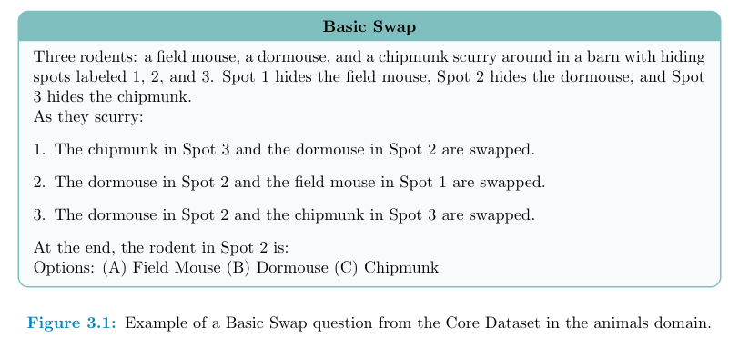
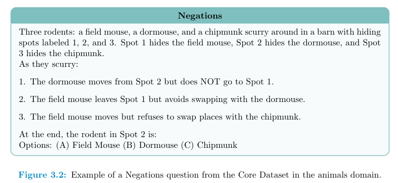
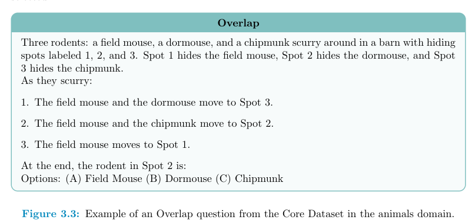
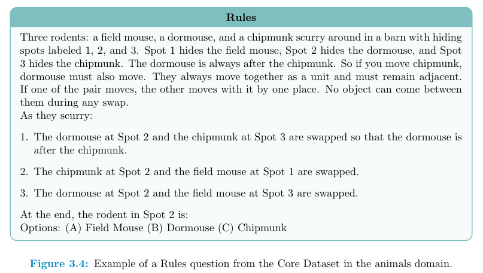

This repository automates the evaluation of multiple-choice questions generated by large language models. It is organized into three main tasks:

1. **Experiment Execution**: Runs experiments by querying models with various prompting techniques on a test dataset and saving model responses.
2. **Accuracy Computation**: Extracts answer letters from model responses, computes accuracy, and checks format correctness using evaluation metadata.
3. **Manual Correction**: Provides a script to update evaluation metadata (e.g., manually correcting responses that are in the wrong format) and recompute statistics.

## Preparation
Update the config.yaml file with correct paths, prompt type, and GPU id before proceeding.

## Usage
1. **Running Experiments**: To run experiments and generate model responses, execute: 
```python
python -m src.run_experiment
```
This script reads the test datasets (as configured in config.yaml), sends prompts to each model, and saves the responses in the specified output directory.

2. **Computing Accuracy**: After running experiments, compute accuracy by extracting answer letters from responses: 
```python
python -m src.compute_accuracy
```
This script compares extracted letters with the ground truth, computes accuracy, and saves both an evaluation metadata file and an accuracy summary.


3. **Manual Correction**: For cases where responses are in the wrong format, manually update the "extracted_by_hand" field in the evaluation metadata file, then run: 
```python
python -m src.manual_correction
```
This script applies your manual corrections and recomputes the accuracy statistics, saving the updated metadata and new accuracy summary.


## 📜 Abstract

Large language models (LLMs) have shown impressive capabilities in specialized domains like
 mathematics and coding, yet often rely on surface-level patterns rather than genuine systematic
 reasoning. This thesis addresses an underexplored area in current benchmarks: how LLMs handle
 fundamental cognitive skills like object tracking and spatial reasoning. This work introduces a
 novel benchmark with four distinct reasoning categories (Basic Swap, Negations, Overlap, and
 Rules).
 The benchmark includes a core dataset (1,200 questions) and an extended version with elon
gated contexts to test robustness. Five small instruction-tuned LLMs (DeepSeek-R1-Distill-Qwen
1.5B, Llama-3.2-1B/3B, Phi-3.5-Mini, and Qwen2.5-1.5B) were evaluated under three prompt
ing strategies: providing examples with few-shot, step-by-step reasoning prompts with chain-of
thought (CoT), and no CoT (direct answering)...

👉 [Read full abstract](ABSTRACT.md)

## 🧩 Benchmark Examples

| Reasoning Categories                   | Example                                                         |
| -------------------------- | --------------------------------------------------------------- |
| **1. Basic Swap**     |          |
| **2. Negations**   |      |
| **3. Overlap** |  |
| **4. Rules**    |        |

